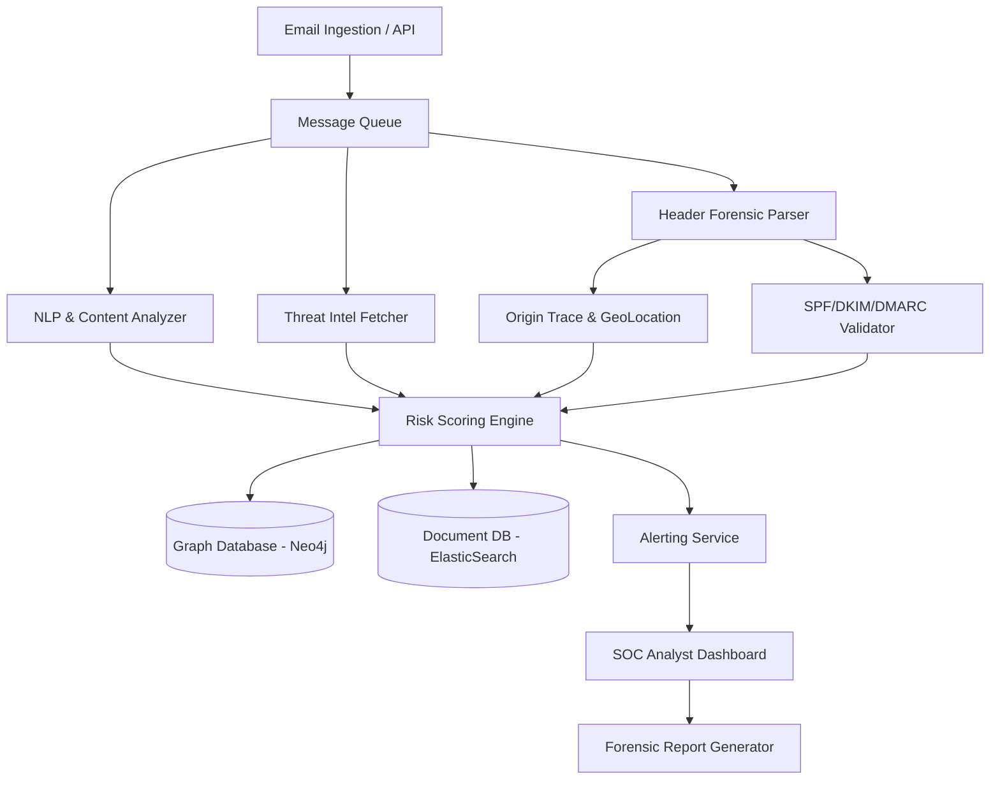

# System Design

## System Architecture

## UI/UX Guidelines

### Theme & Aesthetics
- **Color Palette:** Dark mode optimized for long hours of SOC monitoring. High contrast colors for alerts (Red for Critical, Orange for High, Yellow for Medium).
- **Typography:** Monospaced fonts for raw headers and IP addresses; clean sans-serif for dashboard metrics.

### Key Screens
1. **Global Threat Dashboard:** High-level metrics (Emails processed, blocked threats, active campaigns).
2. **Email Analysis View (Detailed):** 
   - Tab 1: Executive Summary (Fraud Score, Classification).
   - Tab 2: Header Forensics (Parsed received chain).
   - Tab 3: GeoLocation Map (Interactive world map showing IP origin).
   - Tab 4: Graph View (Node-link diagram of related domains/IPs).
3. **Case Management:** Kanban or list view of ongoing investigations.

## Component Design

### 1. NLP Microservice
- Stateless API taking text and returning probability vectors for different threat classes. Can be horizontally scaled with GPU nodes.

### 2. Graph Correlation Worker
- Listens to the database, asynchronously updating the Neo4j graph as new entities are discovered to keep real-time ingestion fast.

### 3. Report Generator
- Assembles data securely, applying PII masking rules before rendering PDF/JSON evidence files.
