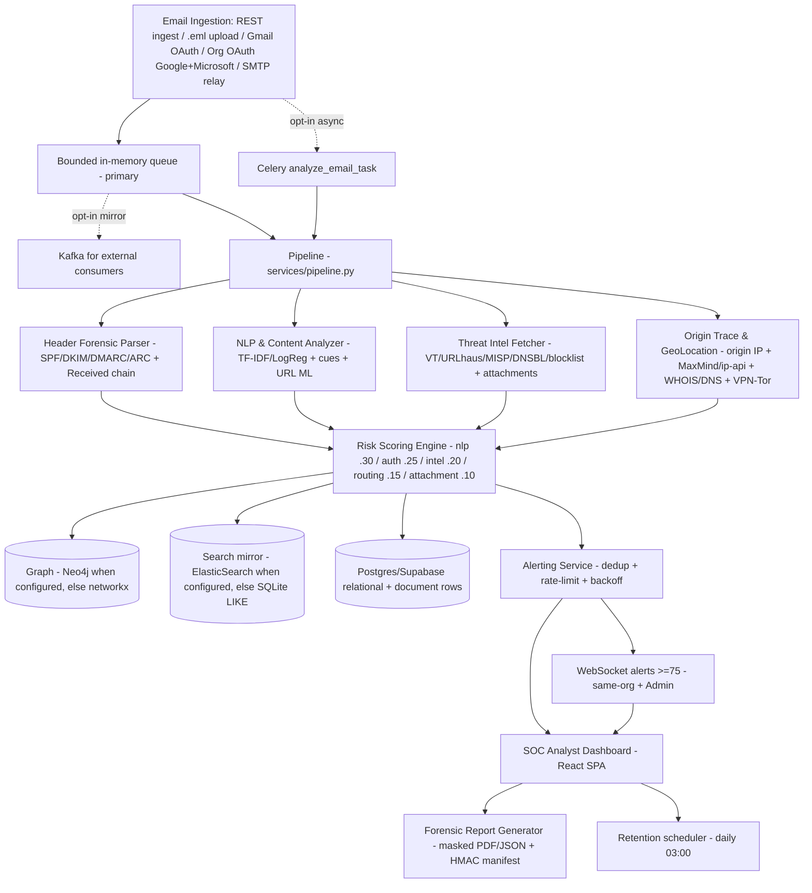

# System Design

## System Architecture

Auth (cross-cutting, not shown above): Supabase owns sessions; `GET /auth/me` + `routers/deps.py` (JWKS/HS256-dev) guard all `/api/v1/*`; roles ReadOnly/Analyst/Admin; tenant-scoped queries (Admin bypass, 404-no-leak). Boot gates in `main.py:lifespan` refuse `CORS *` + credentials, unbounded `CORS_ORIGIN_REGEX`, short `SECRET_KEY` / missing `CUSTODY_KEY` outside `development`.

## UI/UX Guidelines

### Theme & Aesthetics
- **Color Palette:** Light "Inkwise" theme is the default
- **Typography:** Monospaced fonts for raw headers and IP addresses; clean sans-serif for dashboard metrics.

### Key Screens
1. **Global Threat Dashboard (`/dashboard`):** Metrics (emails processed, blocked threats ≥75, active campaigns, classifications + score distribution), ingest panel (paste RFC822 + samples + `.eml` upload + background-queue toggle), Gmail live-import panel, severity filter, recent cards, all-emails table with PDF/JSON downloads, activity feed.
2. **Email Analysis View (`/email/:id`, 5 tabs as implemented `frontend/src/pages.tsx:TABS`):**
   - Tab 1: Summary (Fraud Score, Classification, action).
   - Tab 2: Why this score? (Explainable weighted breakdown bar chart; sums to the score).
   - Tab 3: Header Forensics (Parsed received chain + SPF/DKIM/DMARC).
   - Tab 4: GeoLocation (OSM embed + origin IP/ISP/ASN/VPN-Tor + WHOIS/DNS).
   - Tab 5: Graph View (Custom `GraphSvg` node-link diagram via `GET /graph/related`).
3. **Case Management (`/cases`):** List view of ongoing investigations (create/edit with `CaseUpdate` validation; delete is Admin-only); email linkage validated per tenant.
4. **Mailboxes (`/mailboxes`, present stage):** Organization-level Google/Microsoft OAuth connectors (server-side state + PKCE + allowlisted redirect) with background polling (`MAIL_POLL_MINUTES`, 0 = manual Sync now) and disconnect. Personal Gmail lives separately on the Dashboard panel.
5. **Model Info (`/model`, present stage):** Live classifier metrics from `GET /model/metrics` (accuracy, macro P/R/F1, per-class P/R/F1 + support, confusion matrix, dataset rows).
6. **Gmail live import (present stage):** No visible auth-code field \u2014 the app auto-captures `?code=` from Google's redirect tab and finishes the connection itself.

## Component Design

### 1. NLP Engine (in-process, not a separate microservice)
- `modules/nlp/engine.py:warmup/analyze_text` returns ML score + cues; optional dev-only transformer rerank (pinned revision); horizontally scalable by adding API replicas (stateless) — GPU nodes are roadmap-only.

### 2. Graph Correlation (inline + fallback, not a separate worker)
- `services/pipeline.py` calls `modules/graph/store.py:upsert_email_graph` inline per analyzed mail; reads (`find_campaigns`, `related_entities`) prefer Neo4j when `NEO4J_URI` is set, else networkx — no async worker in this checkout.

### 3. Report Generator
- `modules/reporting/generator.py` + `privacy/chain_of_custody.py`: masked PDF/JSON evidence files with SHA-256 of the `.eml` + HMAC manifest v1 (`CUSTODY_KEY` + `CUSTODY_KEY_PREVIOUS` rotation); report-id filename guard.
